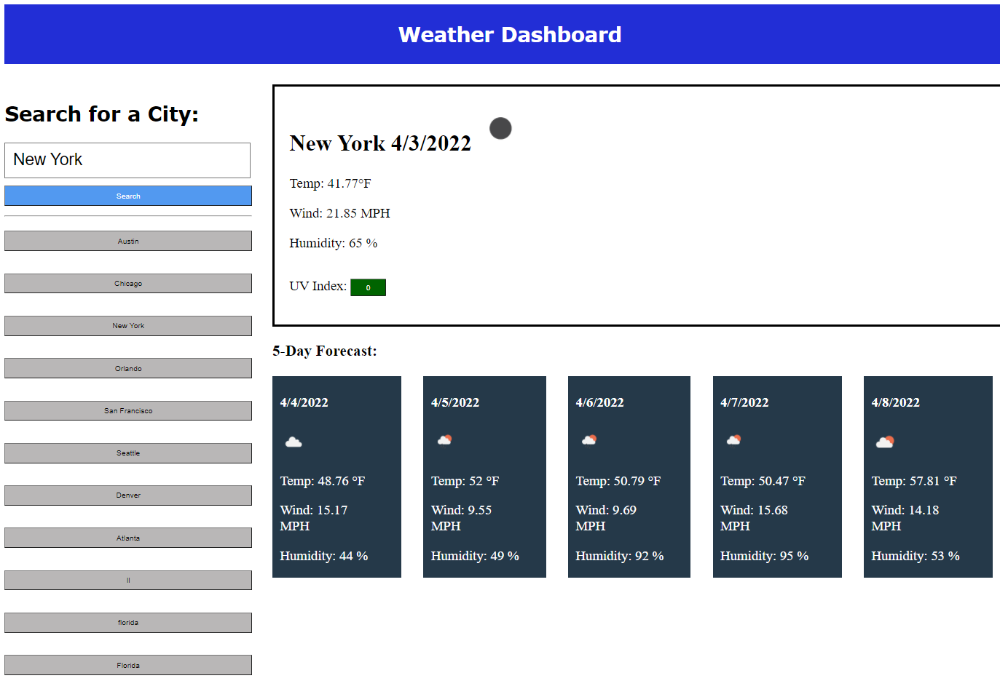

# 06 Server-Side APIs: Weather Dashboard
## Author 
Disha Barua 

## Link
Github Repository: https://github.com/Disha2022/weather_dashboard

Deployed Code: https://disha2022.github.io/weather_dashboard/

## User Story

```
AS A traveler
I WANT to see the weather outlook for multiple cities
SO THAT I can plan a trip accordingly
```

## Tools
1. CSS
2. HTML
3. Javascript
4. JQuery
5. OpenWeather One Call API==> (https://openweathermap.org/api/one-call-api) 


## Files
1. index.html
2. style.css
3. script.js
4. README.md
## Procedure

1. Initialized html, css and JavaScript files.
2. Created html structure and css for main header.
3. Created event handler for "Search" button.
4. Created fetch functions to call coordinates api and then weather api for current day
5. Refactored function to reduce nesting and better use of .then
6. Showed different background color based on UV severity.
7. Added search history in JS, reading local storage on load, saving to local storage after search.
8. Added weather icon by creating img url based on weather api id.
9. Added function to convert date number to formatted date.
10. Added 5 day history.
11. Added css and refactored html structure for css containers.
12. Tested the website, cleaned up JS and removed old days before adding 5 days.
13. Added placeholder and fixed css.

## Demo
The following image and Gif demonstrates the application functionality:





-------------------------------------------------------------------------------------------------------------
## Acceptance Criteria

```
GIVEN a weather dashboard with form inputs
WHEN I search for a city
THEN I am presented with current and future conditions for that city and that city is added to the search history
WHEN I view current weather conditions for that city
THEN I am presented with the city name, the date, an icon representation of weather conditions, the temperature, the humidity, the wind speed, and the UV index
WHEN I view the UV index
THEN I am presented with a color that indicates whether the conditions are favorable, moderate, or severe
WHEN I view future weather conditions for that city
THEN I am presented with a 5-day forecast that displays the date, an icon representation of weather conditions, the temperature, the wind speed, and the humidity
WHEN I click on a city in the search history
THEN I am again presented with current and future conditions for that city
```


## Review

You are required to submit the following for review:

* The URL of the deployed application.

* The URL of the GitHub repository. Give the repository a unique name and include a high-quality README describing the project.

- - -
© 2022 Trilogy Education Services, LLC, a 2U, Inc. brand. Confidential and Proprietary. All Rights Reserved.
